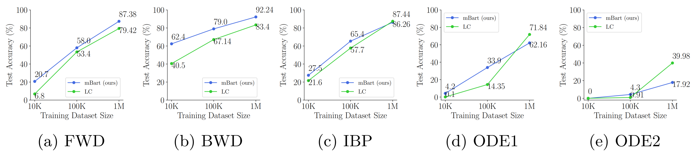

Solving **symbolic mathematics** has always been of in the arena of human
ingenuity that needs compositional reasoning and recurrence. However, recent studies have shown that large-scale language models such as **transformers are universal** and surprisingly can be trained as a sequence-to-sequence
task to solve complex mathematical equations. These large transformer
models need **humongous amounts of training data** to generalize to unseen
symbolic mathematics problems. In this work, we present a sample efficient way of solving the symbolic tasks by 
1. Pretraining the transformer
model with language translation and, 
2. Fine-tuning the pretrained transformer model to solve the downstream task of symbolic mathematics. 

We achieve comparable accuracy on the integration task with our pretrained
model while using around **1.5** orders of magnitude less number of training samples with respect to the state-of-the-art [deep learning for symbolic
mathematics](https://arxiv.org/abs/1912.01412). The test accuracy on differential equation tasks is **consider-
ably lower** comparing with integration as they need higher order recursions
that are not present in language translations. We pretrain our model with
different pairs of language translations. Our results show **language bias**
in solving symbolic mathematics tasks. Finally, we study the robustness
of the fine-tuned model on symbolic math tasks against distribution shift,
and our approach generalizes better in distribution shift scenarios for the
function integration.

# Empirical Evaluation
In orther to examine the transfer from language translation to solving
symbolic math equations and attempt to understand better why this happens and which factors enable this transfer, we desighn the following research questions. we refer to [Lample & Charton (2019)](https://arxiv.org/abs/1912.01412)’s model results with the keyword LC in our tables and visualizations.
## i. **Does this pretrained model help us to use less data for training?**
As studied in Lample & Charton (2019), to train transformer architecture on the symbolic
math data, we need a vast amount of training data for each task to achieve the highest
accuracies (in the order of 40 million to 80 million training samples for each task.).  We can see in the following table that our model outperformed
in the **integration** task, with a considerable gap from the LC model. But it cannot properly
perform on the differential equation task, especially the second-order differential equations. 

|                   | Our Model | LC's Model |
|:-----------------:|:---------:|:----------:|
| Integration (FWD) | 87.4    | 79.4     |
| Integration (BWD) | 92.2    | 83.4    |
| Integration (IBP) | 86.2    | 87.4     |
| ODE 1           | 62.2    | 71.8     |
| ODE 2           | 17.9    | 39.9     |

The following figure extends this exploration by running the same experiment for different orders of magnitude
of training data (i.e., 10K, 100K, and 1M).  Our fine-tuned model has higher
accuracy in comparison to LC in all tasks and with different training sample sizes, except
that in the differential equations the accuracy growth of our model suddenly gets lower than
the LC model when using the 1 million samples for training.

## ii. **Are the results of such fine-tuning, language dependent?**
We investigate whether different languages used to train our pretrained models impact the
results of this transfer learning. The following table shows the evaluation of accuracy of our Marian-MT model (in percentage (%)) on the integration and differential equation solving for different pretrained languages. The highest
accuracy is indicated by bold case in each column (task). We see that the language **has no
major impact** on the results of this fine-tuning.
| Language          | English - Romanian | English - Greek | English - Arabic | English - French | English - Spanish | Greek - English | Arabic - English | French - English | Spanish - English |
|:-----------------:|:------------------:|:---------------:|:----------------:|:----------------:|:-----------------:|:---------------:|:----------------:|:----------------:|:-----------------:|
| Integration (FWD) | 38.8             | 39.3          | 43.9           | 47.7           | 43.5            | 39.1          | 43.3           | **50.5**      | 40.4            |
| Integration (BWD) | 67.8             | 69.5          | 71.3           | **71.4**      | 70.4            | 69.1          | 69.3           | 71.2           | 69.9            |
| Integration (IBP) | 51.5             | 48.6          | **53.5**      | 52.5           | 51.8            | 47.9          | 50.7           | 52.7           | 51.7            |
| ODE 1           | **23.4**        | 17.3          | 16.4           | 18.9           | 18.7            | 16.2          | 22.5           | 19.7           | 20.2            |
| ODE 2           | 1.8              | 2.5           | 2.7            | 2.9            | **3.3**        | 2.2           | 2.3            | 2.3            | 2.0             |
